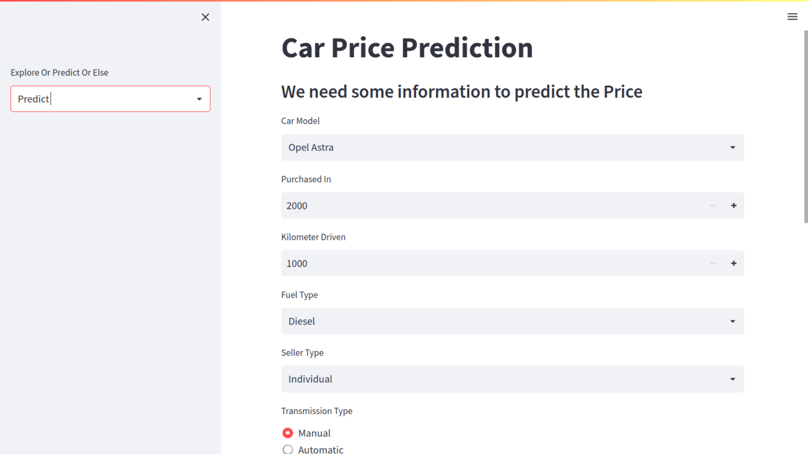

# Least Square

A simple Streamlit WebApp, which can predict Car Price with Machine Learning Models such as **Linear Regression, Ridge Regression, and Lasso Regression**.


### Method 1 - Using Docker
**Prerequisite** - Docker

1. Build Docker Images
```bash
  docker build -t leastsquare:latest .
```
2. Run App in Docker Container
```bash
  docker run leastsquare:latest
```
### Method 2 - Using Virtual Environment
**Prerequisite** - Conda, Python
1. Create a Conda Virtual Environment
```bash
  conda create -n leastsquare
```
2. Activate Virtual Environment
```bash
  conda activate leastsquare
```
3. Install Requirements.txt
```bash
  pip install -r requirements.txt
```
4. Run Streamlit App
```bash
  streamlit run app.py
```

## About Dataset

This data was scraped from [cars24.com](https://www.cars24.com/). 

I used [Octoparse](https://www.octoparse.com/download/windows) to scrape the data from the website.

- Name
- Variant
- Transmission
- km_driven
- Owner_Type
- Fuel
- Price
- Age (Derived from Year Purchased)


## Screenshots

### Explore Page


### Model Page


### Predict Page

